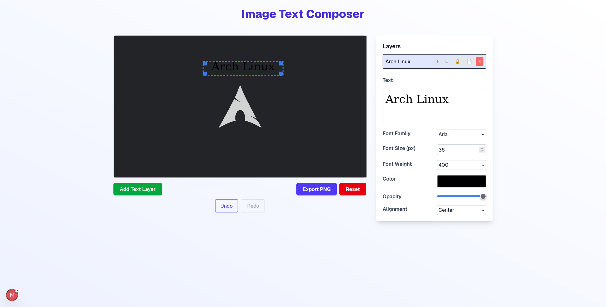

## Overview

**Image Text Composer** is a React & Next.js based web app that allows users to upload PNG images and overlay customizable text layers on top. You can adjust text position, font, size, color, opacity, alignment, and export the final image as a PNG.

This project showcases advanced React state management, dynamic font loading from Google Fonts, canvas manipulation, undo/redo functionality, and responsive design.

Feel free to check out the demo at [image-text-composer-nu.vercel.app](https://image-text-composer-nu.vercel.app) 🚀
---

# Image Text Composer

## Features

- Upload PNG images and preview them on canvas
- Add multiple text layers with full control over:
  - Text content (multi-line supported)
  - Font family (Google Fonts integration)
  - Font size, weight, color, opacity
  - Text alignment (left, center, right)
  - Layer locking, duplicating, and deleting
- Undo and redo editing actions with a stack of 20 changes
- Export your composition as a high-quality PNG image
- Responsive layout that scales images to fit the container perfectly
- Reset editor to upload a new image and start fresh

---

## Tech Stack

- [Next.js 13+](https://nextjs.org/) (App Router, React 18, Server & Client components)
- React + TypeScript
- Canvas API for rendering image and text layers
- Tailwind CSS for styling
---
